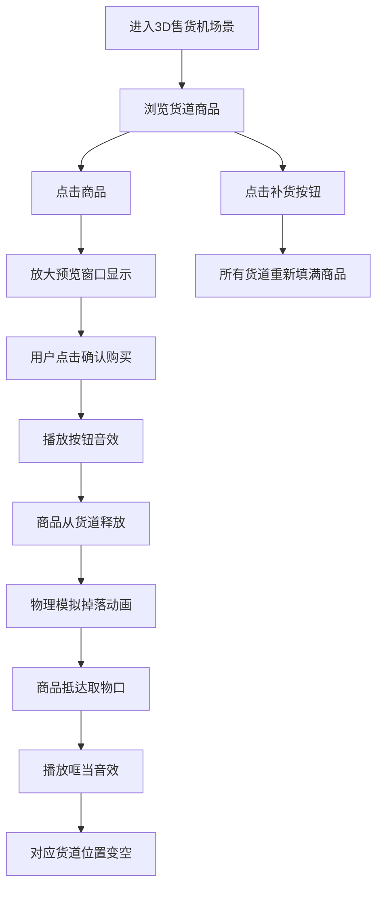

## 1. 产品概述

3D交互式自动售货机模拟器，用户可在浏览器中体验真实的自动售货机购买流程。
- 核心目标：打造沉浸式3D购物体验，包含商品浏览、放大查看、购买掉落动画及音效
- 市场价值：为电商/零售行业提供虚拟展示解决方案，提升用户交互体验

## 2. 核心功能

### 2.1 功能模块

1. **主场景页面**：3D售货机展示、商品陈列、补货按钮

### 2.2 页面详情

| 页面名称 | 模块名称 | 功能描述 |
|-----------|-------------|---------------------|
| 主场景页面 | 3D售货机模型 | 立式售货机外壳、透明玻璃橱窗、内部货道结构、底部取物口 |
| 主场景页面 | 商品陈列 | 多排饮料罐和零食整齐排列，每件商品下方显示价格标签 |
| 主场景页面 | 商品放大查看 | 点击商品弹出放大预览窗口，展示商品详情 |
| 主场景页面 | 购买确认 | 放大预览中显示确认按钮，点击后触发购买流程 |
| 主场景页面 | 掉落动画 | 商品从货道滚落至取物口，伴随物理运动效果 |
| 主场景页面 | 音效系统 | 按钮声、商品掉落"哐当"音效 |
| 主场景页面 | 补货功能 | 一键将所有货道商品重新填满 |
| 主场景页面 | 库存管理 | 货道内商品数量实时显示，售出后对应位置为空 |

## 3. 核心流程

## 4. 用户界面设计

### 4.1 设计风格
- **主色调**：经典自动售货机红白色调（机身#D32F2F，窗框#FAFAFA），搭配霓虹蓝点缀#2196F3
- **按钮风格**：3D立体圆角按钮，带按压效果，补货按钮采用醒目的绿色#4CAF50
- **字体**：采用科技感无衬线字体（Orbitron）搭配清晰易读的正文字体
- **布局风格**：居中对称式3D场景，顶部可添加装饰霓虹灯牌，底部取物口带发光效果
- **3D风格**：真实材质渲染，金属机身拉丝质感，玻璃透明折射效果

### 4.2 页面设计概述

| 页面名称 | 模块名称 | UI元素 |
|-----------|-------------|-------------|
| 主场景页面 | 3D售货机 | 立式长方体机身、透明玻璃橱窗、分层货道、底部取物口凹槽、顶部装饰灯牌 |
| 主场景页面 | 商品陈列 | 饮料罐（圆柱形带拉环）、零食袋（长方体带褶皱）、下方悬浮价格标签 |
| 主场景页面 | 放大预览 | 半透明黑色遮罩、居中放大商品、价格信息、取消/确认按钮 |
| 主场景页面 | 补货按钮 | 右下角悬浮绿色3D按钮，带补货图标 |
| 主场景页面 | 取物口 | 底部凹槽内部，商品掉落后可看到，带发光提示 |

### 4.3 响应式设计
- 桌面端优先，全屏沉浸式3D体验
- 移动端自适应缩放，保证售货机完整可见
- 触摸优化，支持手机点击交互

### 4.4 3D场景指引
- **环境**：室内柔和灯光场景，背景为浅色渐变墙面，地板带轻微反光
- **光照**：主光源（暖色Key Light）+ 补光（冷色Fill Light）+ 环境光，橱窗内部添加发光效果突出商品
- **相机**：透视相机，初始视角略微仰视，售货机居中占画面70%宽度，支持轻微轨道旋转查看
- **构图**：售货机位于画面正中央，左右留出呼吸空间，顶部可添加装饰性霓虹招牌"DRINKS & SNACKS"
- **交互**：鼠标悬停商品时轻微放大高亮，点击触发预览
- **后处理**：Bloom发光效果（霓虹招牌、取物口）、轻微抗锯齿、环境光遮蔽（AO）增强立体感
- **性能**：单页面应用，3D模型使用基础几何体组合，控制面数在5000以内，目标帧率60fps
