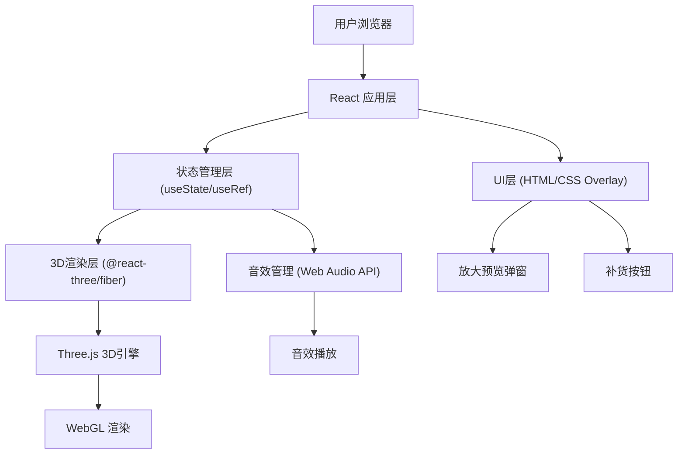

## 1. 架构设计



## 2. 技术描述

- **前端框架**: React@18 + TypeScript
- **构建工具**: Vite@6 (vite-init初始化)
- **3D渲染**: Three.js + @react-three/fiber@8 + @react-three/drei@9 + @react-three/postprocessing@2
- **样式方案**: TailwindCSS@3.4
- **状态管理**: React Hooks (useState, useRef, useCallback)
- **后处理效果**: EffectComposer (Bloom, AO)
- **音效**: Web Audio API (程序化合成音效，无需外部音频文件)
- **物理动画**: 自定义缓动函数 + requestAnimationFrame

## 3. 目录结构

```
lc-380-1/
├── src/
│   ├── components/
│   │   ├── VendingMachine/
│   │   │   ├── index.tsx          # 售货机主组件
│   │   │   ├── MachineBody.tsx    # 机身外壳
│   │   │   ├── Products.tsx       # 商品陈列
│   │   │   ├── Product.tsx        # 单个商品
│   │   │   ├── Dispenser.tsx      # 取物口
│   │   │   └── FallingProduct.tsx # 掉落商品动画
│   │   ├── UI/
│   │   │   ├── ProductPreview.tsx # 放大预览弹窗
│   │   │   └── RestockButton.tsx  # 补货按钮
│   │   └── Scene.tsx              # 3D场景包装
│   ├── hooks/
│   │   ├── useSound.ts            # 音效Hook
│   │   └── useInventory.ts        # 库存管理Hook
│   ├── data/
│   │   └── products.ts            # 商品数据
│   ├── types/
│   │   └── index.ts               # 类型定义
│   ├── App.tsx
│   ├── main.tsx
│   └── index.css
├── package.json
├── vite.config.ts
├── tsconfig.json
└── tailwind.config.js
```

## 4. 类型定义

```typescript
// 商品类型
interface Product {
  id: string;
  name: string;
  price: number;
  type: 'drink' | 'snack';
  color: string;        // 商品主色
  labelColor: string;   // 标签颜色
  row: number;          // 所在行 (0-4)
  col: number;          // 所在列 (0-3)
}

// 库存状态
type InventoryState = Record<string, boolean>;

// 掉落动画状态
interface FallingState {
  productId: string | null;
  isAnimating: boolean;
}

// 预览状态
interface PreviewState {
  product: Product | null;
  isOpen: boolean;
}
```

## 5. 商品数据模型

```typescript
// 5行 x 4列 = 20个商品位
// 前3行为饮料（圆柱体），后2行为零食（长方体）
export const PRODUCTS: Product[] = [
  // 第0行 - 饮料
  { id: 'd00', name: '可口可乐', price: 3.5, type: 'drink', color: '#E53935', labelColor: '#FFFFFF', row: 0, col: 0 },
  { id: 'd01', name: '百事可乐', price: 3.0, type: 'drink', color: '#1565C0', labelColor: '#FFFFFF', row: 0, col: 1 },
  { id: 'd02', name: '雪碧', price: 3.0, type: 'drink', color: '#43A047', labelColor: '#FFFFFF', row: 0, col: 2 },
  { id: 'd03', name: '芬达橙', price: 3.0, type: 'drink', color: '#FB8C00', labelColor: '#FFFFFF', row: 0, col: 3 },
  // 第1行 - 饮料
  { id: 'd10', name: '农夫山泉', price: 2.0, type: 'drink', color: '#00897B', labelColor: '#FFFFFF', row: 1, col: 0 },
  { id: 'd11', name: '红牛', price: 6.0, type: 'drink', color: '#FFD600', labelColor: '#000000', row: 1, col: 1 },
  { id: 'd12', name: '王老吉', price: 4.0, type: 'drink', color: '#B71C1C', labelColor: '#FFD700', row: 1, col: 2 },
  { id: 'd13', name: '加多宝', price: 4.0, type: 'drink', color: '#C62828', labelColor: '#FFD700', row: 1, col: 3 },
  // 第2行 - 饮料
  { id: 'd20', name: '元气森林', price: 5.0, type: 'drink', color: '#8D6E63', labelColor: '#FFFFFF', row: 2, col: 0 },
  { id: 'd21', name: '东方树叶', price: 5.5, type: 'drink', color: '#2E7D32', labelColor: '#FFF8E1', row: 2, col: 1 },
  { id: 'd22', name: '三得利乌龙', price: 5.0, type: 'drink', color: '#5D4037', labelColor: '#FFECB3', row: 2, col: 2 },
  { id: 'd23', name: '雀巢咖啡', price: 5.0, type: 'drink', color: '#6D4C41', labelColor: '#FFFFFF', row: 2, col: 3 },
  // 第3行 - 零食
  { id: 's30', name: '乐事薯片', price: 8.0, type: 'snack', color: '#FFCA28', labelColor: '#BF360C', row: 3, col: 0 },
  { id: 's31', name: '奥利奥', price: 9.9, type: 'snack', color: '#263238', labelColor: '#FFFFFF', row: 3, col: 1 },
  { id: 's32', name: '旺旺雪饼', price: 6.0, type: 'snack', color: '#FFF9C4', labelColor: '#E65100', row: 3, col: 2 },
  { id: 's33', name: '好丽友派', price: 7.0, type: 'snack', color: '#795548', labelColor: '#FFFFFF', row: 3, col: 3 },
  // 第4行 - 零食
  { id: 's40', name: '德芙巧克力', price: 12.0, type: 'snack', color: '#4E342E', labelColor: '#D4A574', row: 4, col: 0 },
  { id: 's41', name: '士力架', price: 6.0, type: 'snack', color: '#3E2723', labelColor: '#FFAB40', row: 4, col: 1 },
  { id: 's42', name: '恰恰瓜子', price: 5.0, type: 'snack', color: '#D84315', labelColor: '#FFF176', row: 4, col: 2 },
  { id: 's43', name: '康师傅饼干', price: 5.5, type: 'snack', color: '#A1887F', labelColor: '#FFFFFF', row: 4, col: 3 },
];
```

## 6. 音效方案（Web Audio API程序化合成）

无需外部音频文件，使用Web Audio API实时合成：

- **按钮点击音**: 正弦波快速衰减 (440Hz → 220Hz, 80ms)
- **掉落哐当音**: 低频噪声脉冲 + 高频金属撞击声 (两次短促触发，间隔150ms)
- **补货提示音**: 上升音阶 (C4 → E4 → G4, 每音150ms)
